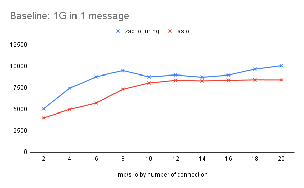
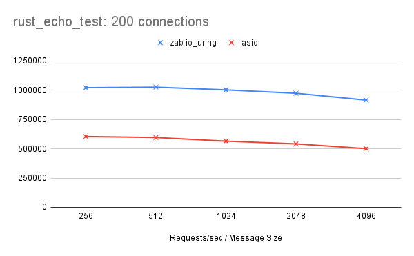
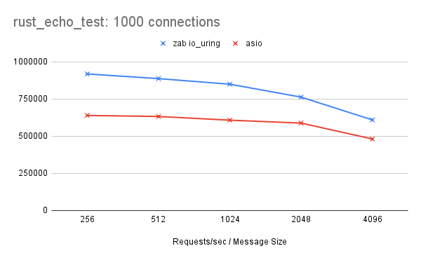

:blogpost: true
:date: Mar 3, 2022
:author: Donald Rupin
:category: benchmarking
:language: English

#############################
Benchmarking: ZAB vs ASIO 3/3
#############################

To benchmark the ZAB's performance we performed benchmarks doing a client/server ping-pong networking test to measure total throughput and using an independent echo benchmark tester to test requests per second. We compared the results against a program with identical logic that uses the `asio library <https://github.com/chriskohlhoff/asio>`_. The results were surprising and showed on average ZAB had in comparison to asio around 20% increased throughput and 60% increased requests per second. 

The two main differences between the programs are that ZAB is entirely coroutine based and is driven in the backend by `liburing <https://github.com/axboe/liburing>`_. Asio on the other handle is entirely callback based and is driven in the backend by an epoll based event loop. So this comparison is essentially callbacks vs coroutines and event loop vs asynchronous syscall facility. 

The benchmark code and raw results can be found `here: zab_benchmark <https://github.com/Donald-Rupin/zab_benchmark>`_ and the customary link to the `ZAB repo is here <https://github.com/Donald-Rupin/zab>`_.

.. note::
    Disclaimer 1: I don't claim to be an asio expert so I may be doing something wrong or inefficiently.  

    Disclaimer 2: The benchmarks were performed over localhost. Benchmarks using production like network channels are the next step.

Methodology
###########

IO Throughput
*************

The first test is for IO throughput for a client and server built using their respective backends. It was a ping-pong test comprised of three options: the number of concurrent connections (Con), the number of messages to send (#m) and the size of the message (S). A client and server program was built for both ZAB and asio. 

Client Program
^^^^^^^^^^^^^^

The client program takes the options and implements the ping-pong logic. 

.. code-block:: bash
    :caption: Client Logic

    for 0 to Con:
        concurrently do:
            connect
            for 0 to #m:
                send message of size s
                read message of size s

The duration of the above logic is timed and compared against the total amount of data sent and received by the client to produce the Mb/s IO throughput. Context and event loop setup is outside of the timed zone.

An exmaple of what the stream loop looks like across both libraries (with error handling removed) is:

.. code-block:: c++
    :caption: Zab Client

    zab::simple_future<bool>
    echo_client::run_stream(zab::tcp_stream _stream) noexcept
    {
        std::vector<char> buffer(message_size_, 42);
        for (auto i = 0ull; i < meesage_count_; ++i)
        {
            /* Write and read the message back */
            auto [_, amount] =
                co_await zab::wait_for(engine_, _stream.write(buffer), _stream.read(buffer));
        }

        co_return true;
    }

While for asio it looks like this:

.. code-block:: c++
    :caption: Asio Client

    void
    session::run_stream()
    {
        buffer_.resize(message_size_, 42);
        do_write();
        do_read(0, 0);
    }

    void
    session::do_read(std::uint32_t _up_to, std::uint32_t _iterations)
    {
        auto self(shared_from_this());
        socket_.async_read_some(
            asio::buffer(buffer_.data() + _up_to, buffer_.size() - _up_to),
            [this, self, _up_to, _iterations](std::error_code ec, std::uint32_t length)
            {
                if (_up_to + length != buffer_.size())
                {
                    /* Keep going in this iteration */
                    do_read(_up_to + length, _iterations);
                }
                else
                {
                    if (_iterations + 1 < meesage_count_)
                    {
                        /* Do next iteration */
                        do_write();
                        do_read(0, _iterations + 1);
                    }
                    else
                    {
                        /* finished */
                    }
                }
                
            });
    }

    void
    session::do_write()
    {
        auto self(shared_from_this());
        asio::async_write(
            socket_,
            asio::buffer(buffer_.data(), buffer_.size()),
            [self](std::error_code ec, std::uint32_t length)
            {
                /* async_write guarantees all is written or error */
            });
    }

Server Program
^^^^^^^^^^^^^^

In the server case, the server does not know the message length nor the number of messages to echo. The server will simply keep echoing anything it receives until the connection is dropped. 

.. code-block:: bash
    :caption: Server Logic

    concurrently do:
        while true:
            accept

        concurrently for each conection:
            while connected:
                read_some
                write_some

The server logic for ZAB looks like this (error checking removed):

.. code-block:: c++
    :caption: Zab Server

    zab::async_function<>
    echo_server::run_acceptor() noexcept
    {
        int connection_count = 0;
        if (acceptor_.listen(AF_INET, port_, 50000))
        {
            co_await zab::for_each(
                acceptor_.get_accepter(),
                [&](auto&& _stream) noexcept 
                {
                    run_stream(connection_count++, std::move(*_stream));
                });
        }
    }

    zab::async_function<>
    echo_server::run_stream(int _connection_count, zab::tcp_stream _stream) noexcept
    {
        static constexpr auto kBufferSize = 65534;

        /* Lets load balance connections between available threads... */
        zab::thread_t thread{(std::uint16_t)(_connection_count % engine_->number_of_workers())};
        co_await yield(thread);

        std::vector<std::byte>           buffer(kBufferSize);
        zab::tcp_stream::op_control oc{.data_ = buffer.data(), .size_ = kBufferSize};

        auto reader = _stream.get_reader(&oc);
        auto writer = _stream.get_writer(&oc);

        while (!_stream.last_error())
        {
            auto size = co_await reader;

            oc.size_ = *size;
            co_await writer;

            oc.size_ = kBufferSize;
        }
    }

The server logic for asio looks like this (error checking removed):

.. code-block:: c++
    :caption: Asio Server

    void
    echo_server::do_accept()
    {
        acceptor_.async_accept(
            [this](std::error_code ec, tcp::socket socket)
            {
                std::make_shared<session>(std::move(socket))->start();
                do_accept();
            });
    }

    void
    session::start()
    {
        static constexpr auto kBufferSize = 65534;
        data_.resize(kBufferSize);
        do_read();
    }

    void
    session::do_read()
    {
        auto self(shared_from_this());
        socket_.async_read_some(
            asio::buffer(data_.data(), data_.size()),
            [this, self](std::error_code ec, auto length) mutable
            {
                do_write(length); 
            });
    }

    void
    session::do_write(std::size_t _length)
    {
        auto self(shared_from_this());
        asio::async_write(
            socket_,
            asio::buffer(data_.data(), _length),
            [this, self](std::error_code ec, auto) mutable
            {
                do_read();
            });
    }

The code for each program is adapted from the example programs provided by each project. The application parts in each framework are similar and boil down to callback vs coroutine differences. The code was compiled with the same flags and optimisations and in Release mode. 

Results
=======

.. note::

    Since we are running both client and server for each event loop the throughput could be doubled. For example, the 1Gb message is read and written by *both* the client and the server. So in practice 4Gb's (where we say 2Gb) of data is processed. This does not affect the % difference.

We performed two ping-pong benchmarks on the code: One large message and 100 medium-sized messages.

**One Large Message**

In this benchmark, we sent a 1Gb message (2Gb in io per connection). This is more or less a baseline test as there is little concurrency and the connection is a one-off message. We performed this with connections increasing from 2 to 20 in increments of 2. 

The results show that ZAB overall performs better and the difference between the two is more obvious with fewer connections and as the connections count passes the number of available CPU cores (16). 

**Onehundred Medium Messages**

In this benchmark, we sent 100 10Mb messages (2000Mb in io per connection). We performed this with connections increasing from 100 to 1000 in increments of 100. 

.. image:: images/10mb.png
   :width: 600

Again, the results show that ZAB overall performs better. Mirroring the baseline, the difference is more obvious with fewer connections.

Requests per second
*******************

This benchmark utilises the same server code as the IO throughput but uses an external tool to measure the requests per second. This allows us to explicitly benchmark the server itself, where the client is acting under the same conditions. The tool we used is `rust_echo_bench <https://github.com/haraldh/rust_echo_bench>`_. 

We ran the benchmarker for 30 seconds altering the number of connections and the size of the message sent. the test was run for 200 connections and 1000 connections for message sizes: 256, 512, 1024, 2048 and 4096.

**200 connections**

We can see that ZAB was consistently serving around  60% more requests per second.

**1000 connections**

We can see that ZAB performed better for all message sizes. Although, the difference shrunk as the message size increased.

Discussion
##########

The original version of ZAB used to run this benchmark differed greatly from the final version. This benchmarking was as much an exercise of self-improvement and discovery, as a comparative work. The ZAB `alpha release <https://github.com/Donald-Rupin/zab/releases/tag/v0.0.0.1-alpha>`_ was fully epoll backed. It widely underperformed against the asio implementation. Additionally, asio has a backend implementation that utilises liburing too. Comparatively, this implementation was an entire order of magnitude slower than both asio epoll and ZAB liburing. So I did not include this in the comparison.

Using profiling tools I was able to identify bottlenecks and chokepoints within the original ZAB epoll implementation. Iterating on the design I was able to get the performance to a similar level as asio, but with more variability. Going down the rabbit hole of asynchronous programming techniques led me to liburing and io_uring. This original implementation of liburing had a similar performance as asio.  Further profiling and some optimisations on the coroutine elements brought us to the current results.

There are still some big improvements that can be made which I believe will further increase the frameworks speed. A big warning to potential users is that coroutines can be very slow. Particularly in hot paths. Against the backdrop of IO, it isn't the operation of coroutines (resuming and suspending), it is the creation and deconstruction that impacts performance. As an example, changing from a ``zab::simple_future<>`` to a ``zab::resuable_future<>`` for accepting connections netted a 15% increase in requests per second. The next big improvement for ZAB is to favour reusable coroutines and focus on generic awaitable types in replacement to coroutine chaining.

It is worth mentioning that asio has far greater QoL implementation details and more structured error reporting mechanisms. This comes with asio's maturity as a library and the years of production experience it has. At this stage, ZAB only provides the coroutine executer and a very thin coroutine wrapper to liburing functionality. As ZAB matures the goal is to provide more robust QoL and error reporting mechanisms. The next big leap in testing and maturity will be its operation within production-like environments as a means of becoming more battle-hardened.  

